# 第11章 支付系统

在本章中，我们设计一个支付系统。近年来，电子商务在全球范围内爆发式增长。支撑每一笔交易顺利进行的核心，是一个可靠、可扩展且灵活的支付系统。

根据维基百科的定义：“支付系统是任何通过转移货币价值来结算金融交易的系统。这包括实现交易所需的机构、工具、人员、规则、程序、标准和技术”[1]。

支付系统表面上容易理解，但对许多开发者而言却充满挑战——因为一个微小的错误都可能导致巨额损失和信誉受损。不过别担心！本章将一步步揭开支付系统的神秘面纱。

## 第1步 - 理解问题并确定设计范围

支付系统对不同的人意味着不同的事。有些人认为它像 Apple Pay 或 Google Pay 这样的数字钱包；而另一些人则认为它是处理支付的后端系统，如 PayPal 或 Stripe。因此，在设计之前，必须先明确需求。以下是候选人与面试官之间的典型对话：

Candidate: 我们要构建哪种支付系统？

Interviewer: 假设你在为一个类似 Amazon.com 的电商应用设计支付后端。当客户下单后，支付系统处理所有与资金流动相关的部分。

Candidate: 系统支持哪些支付方式？信用卡、PayPal、银行卡等？

Interviewer: 实际系统会支持所有这些方式。但在本次设计中，我们以信用卡支付为例。

Candidate: 我们自己处理信用卡支付吗？

Interviewer: 否，我们使用第三方支付处理器，如 Stripe、Braintree 或 Square。

Candidate: 我们是否在系统中保存信用卡信息？

Interviewer: 不保存。由于涉及极高的安全性和合规要求，系统不直接存储卡号，由第三方支付机构负责。

Candidate: 应用是全球性的么？是否需要多币种和国际支付支持？

Interviewer: 是的，假设应用面向全球用户，但本次面试中我们仅假设使用一种货币。

Candidate: 系统每天处理多少笔交易？

Interviewer: 每天约 100 万笔。

Candidate: 是否需要支持卖家的打款流程（pay-out flow）？

Interviewer: 是的，需要。

Candidate: 我认为我已经收集齐了所有的需求。还有什么我应该注意的吗？

Interviewer: 有的。一个支付系统会与许多内部服务（例如会计、分析等）以及外部服务（例如支付服务提供商）交互。当某个服务出现故障时，我们可能会在不同的服务之间看到不一致的状态。因此，我们需要执行**对账（reconciliation）**并修复任何不一致的情况。这也是一个需求。

通过这些问题，我们对功能性和非功能性需求都有了清晰的认识。在本次面试中，我们重点设计一个支持以下功能的支付系统。

### 功能需求
* **收款流程（Pay-in flow）：** 支付系统代表卖家接收买家的付款。

* **打款流程（Pay-out flow）：** 支付系统向全球卖家发放款项。

### 非功能性需求
* **可靠性与容错性：** 必须妥善处理支付失败的情况。

* **对账流程：** 系统需支持内部服务（支付、会计等）与外部服务（支付提供商）之间的异步对账机制。该流程以异步方式验证各系统间支付信息的一致性。

### 粗略估算

系统每天需要处理 1,000,000 笔交易, 即
$$
\frac{1{,}000{,}000\ \text{transactions}}{10^5\ \text{seconds}} = 10\ \text{transactions per second (TPS)}
$$
也就是每秒约 $10$ 笔交易(TPS)。对典型数据库而言，$10\ \text{TPS}$ 并不是一个高负载数字, 这意味着本次设计重点在于**如何正确处理支付交易**，而不是追求高吞吐量。

## 第2步 - 提出高层设计并获得认可

从宏观层面来看，支付流程可以分为两个阶段，以反映资金流动的过程：

* **收款流程（Pay-in flow）**  
* **打款流程（Pay-out flow）**  

以 Amazon 为例：当买家下单后，资金首先流入 Amazon 的银行账户，这就是收款流程。虽然资金暂时在 Amazon 的账户中，但大部分属于卖家，Amazon 只是代管资金并收取服务费。当商品发货、资金可以释放时，Amazon 会将扣除手续费后的余额从自己的银行账户转入卖家的账户，这一过程就是打款流程。
 图 1 展示了简化的收款与打款资金流向。

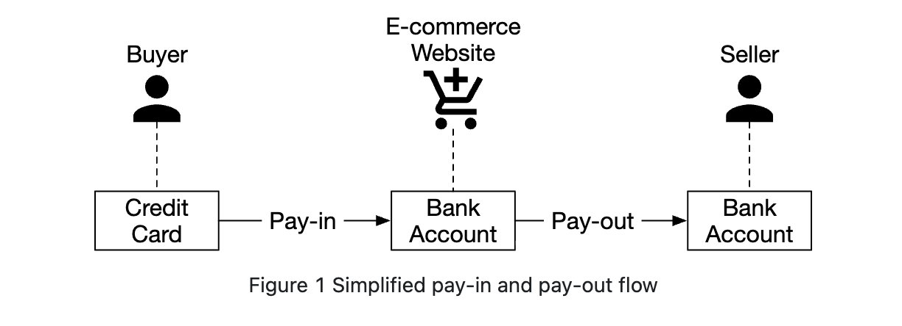

### 收款流程（Pay-in flow）

高层次的支付流入（Pay-in）流程设计图如图 2 所示。下面让我们来看一下系统中每个组件的具体作用。

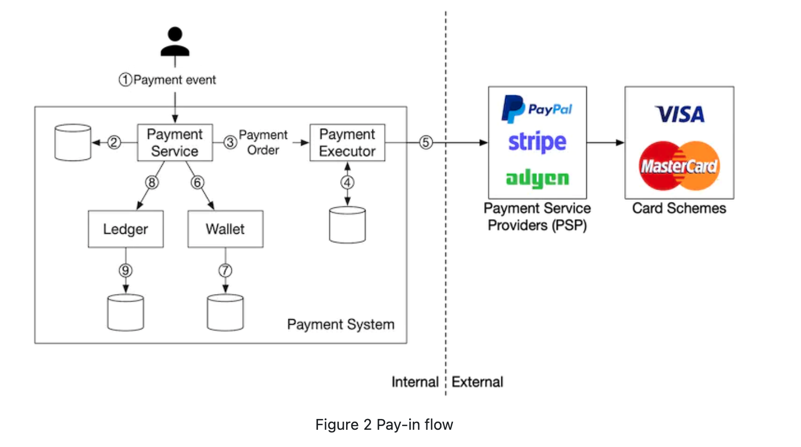

#### 支付服务（Payment Service）
支付服务负责接收用户的支付事件并协调整个支付过程。它首先会进行风险检查（Risk Check），确保符合诸如反洗钱（AML）和反恐融资（CFT）等法规要求[2]，并检测是否存在洗钱或恐怖融资等可疑行为。 支付服务只会处理通过风险检测的支付请求。 风险检测通常由专业的第三方服务提供，因为该领域复杂且专业性高。

#### 支付执行器（Payment Executor）
支付执行器负责通过支付服务提供商（PSP）执行单笔支付订单。 一个支付事件可能包含多个支付订单。

#### 支付服务提供商（PSP）
PSP 负责将资金从账户 A 转移到账户 B。  在此简化的场景中，PSP 从买家的信用卡账户中扣款。

#### 卡组织（Card Schemes）
卡组织是负责处理信用卡交易的机构，例如 Visa、MasterCard、Discover 等。  它们构成了一个庞大而复杂的生态系统[3]。

#### 总账系统（Ledger）
总账系统记录每笔支付交易的财务信息。  例如，当用户向卖家支付 \$1 时，在账簿中记为用户账户借方 -\$1，卖家账户贷方 +\$1。  总账系统对于后续的财务分析、网站营收计算以及未来预测都至关重要。

#### 钱包系统（Wallet）
钱包系统维护商家的账户余额，并可记录每个用户的累计支付金额。

如图 2 所示，一个典型的收款流程如下：  

1. 用户点击“下单”按钮时，会生成一个支付事件并发送至支付服务。  
2. 支付服务将支付事件存储到数据库。  
3. 若一个支付事件包含多个支付订单（例如一次结账包含多个卖家的商品），支付服务会为每个订单调用支付执行器。  
4. 支付执行器将支付订单信息存入数据库。  
5. 支付执行器调用外部 PSP 处理信用卡支付。  
6. 当支付执行成功后，支付服务更新钱包系统，记录卖家的可用余额。  
7. 钱包服务将更新后的余额信息写入数据库。  
8. 当钱包更新成功后，支付服务调用总账系统（Ledger）进行账务更新。  
9. 总账服务将新的账目信息追加写入数据库。

### 支付服务 API 设计

支付服务遵循 RESTful API 设计规范。

#### POST /v1/payments
执行一次支付事件（一次支付事件可包含多个订单）。  请求参数示例：

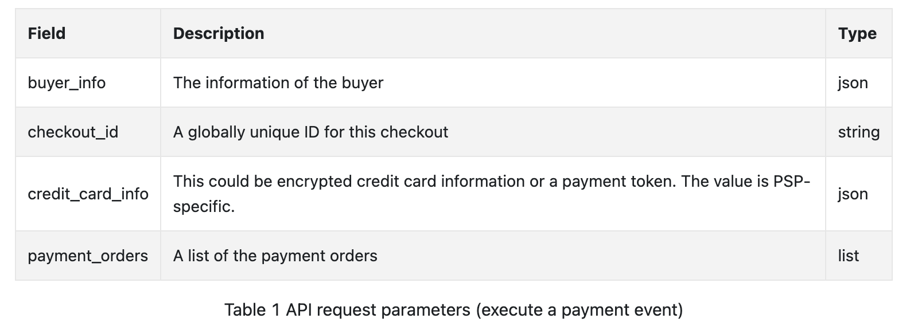

其中每个 `payment_order` 的结构如下：

**注意：**`payment_order_id` 在全局范围内唯一. 当支付执行器向第三方 PSP 发送支付请求时. 该 `payment_order_id` 会被 PSP 用作去重标识，也称“幂等键（idempotency key）”。

你可能注意到，“amount” 字段的数据类型是字符串而不是 double。  使用 double 并不合适，原因如下：  

1. 不同系统在序列化与反序列化时可能存在精度差异，导致舍入误差。  

2. 数值可能极大（如日本 GDP 约为 \(5 \times 10^{14}\) 日元）或极小（如比特币最小单位 satoshi = \(10^{-8}\)）。  

因此建议在数据传输与存储阶段使用字符串，仅在显示或计算时转换为数值。

#### GET /v1/payments/{id}

此接口根据 `payment_order_id` 返回单个支付订单的执行状态。  

上述支付 API 设计与一些知名 PSP 的接口风格类似。  若想了解更全面的支付 API 设计，可以参考 Stripe 的官方文档 [5]

### 支付服务的数据模型

我们需要两张表：**支付事件表（Payment Event）**和 **支付订单表（Payment Order)**。 当我们为支付系统选择存储解决方案时，**性能通常不是最重要的因素**。相反，我们更关注以下几个方面：

1. 经过验证的稳定性。该存储系统是否已被其他大型金融公司使用多年（例如超过 5 年），并获得积极反馈。
2. 支持工具的丰富性，例如监控和排查工具。
3. 数据库管理员（DBA）就业市场的成熟度。我们是否能招聘到有经验的 DBA 是一个非常重要的考虑因素。

通常，我们更倾向于选择支持 ACID 事务的传统关系型数据库，而不是 NoSQL 或 NewSQL。支付事件表包含详细的支付事件信息。它的结构如下所示：

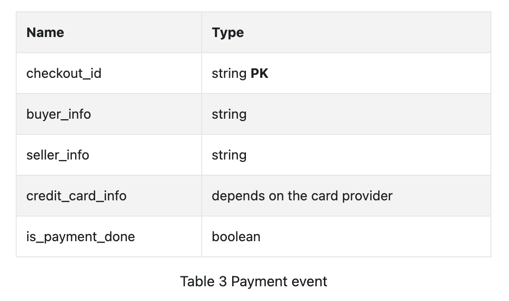

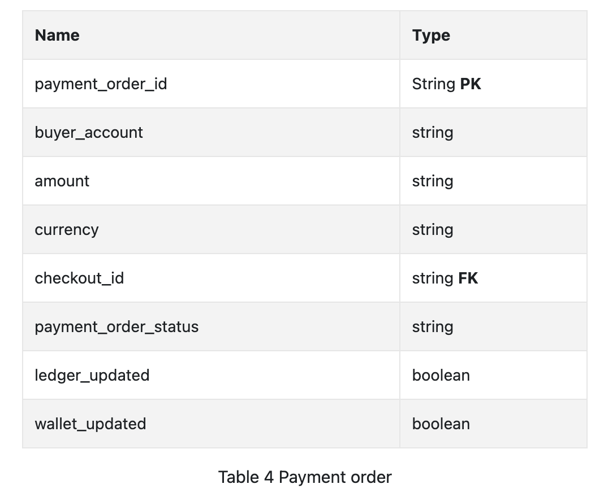

在我们深入研究这些表格之前，先来看一些背景信息。

* **checkout_id** 是外键。一次结账会创建一个支付事件（payment event），该事件可能包含多个支付订单（payment orders）。
* 当我们调用第三方支付服务提供商（PSP）从买家的信用卡中扣款时，资金不会直接转入卖家的账户。相反，资金会先进入电商网站的银行账户，这个过程称为 收款流程（pay-in）。  当满足付款条件（pay-out condition）时（例如商品已交付），卖家会发起付款（pay-out），此时资金才会从电商网站的银行账户转入卖家的银行账户。  因此，在收款流程中，我们只需要买家的银行卡信息，而不需要卖家的银行账户信息。

在支付订单表（表 4）中，*payment_order_status* 是一个枚举类型（enum），用于保存支付订单的执行状态。执行状态包括：NOT_STARTED（未开始）, EXECUTING（执行中）, SUCCESS（成功）,FAILED（失败）. 更新逻辑如下：

1. 支付订单的初始状态是 **NOT_STARTED**。  

2. 当支付服务将支付订单发送给支付执行器时，状态更新为 **EXECUTING**。  

3. 支付服务根据支付执行器的响应，将状态更新为 **SUCCESS** 或 **FAILED**。  

一旦支付订单状态为 **SUCCESS**，支付服务会调用钱包服务（wallet service）更新卖家的账户余额，并将 **wallet_updated** 字段更新为 **TRUE**。在此处我们简化设计，假设钱包更新总是成功的。  

完成后，支付服务的下一步是调用账本服务（ledger service）更新账本数据库，并将 **ledger_updated** 字段更新为 **TRUE**。  

当相同 **checkout_id** 下的所有支付订单都成功处理后，支付服务会将支付事件表（payment event table）中的 **is_payment_done** 字段更新为 **TRUE**。 通常会有一个定时任务（scheduled job）以固定间隔运行，用于监控正在进行中的支付订单状态。如果某个支付订单在阈值时间内未完成，系统会发送警报，以便工程师进行调查。

### 复式记账系统（Double-entry Ledger System）

在账本系统中有一个非常重要的设计原则：复式记账原则（也称为双重记账原则或复式簿记 [6])。复式记账系统是任何支付系统的基础，也是确保账目准确的关键。  它会将每一笔支付交易记录到两个独立的账本账户中，金额完全相同：  一个账户借记（debit），另一个账户贷记（credit）相同的金额（见表 5）。

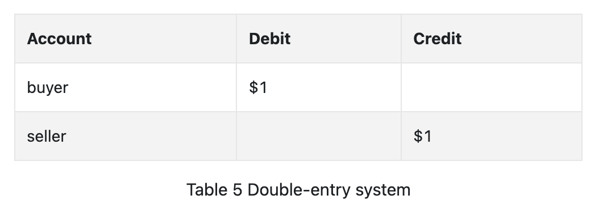

复式记账系统规定：所有交易记录的借贷总和必须为 0。少了一分钱，就意味着另一个账户多了一分钱。这种机制提供了端到端的可追溯性，并确保整个支付流程中的一致性。想了解如何实现复式记账系统，可以参考 Square 的工程博客：《不可变的复式记账数据库服务（immutable double-entry accounting database service）》[7]。

### 托管支付页面（Hosted Payment Page）

大多数公司倾向于不在内部存储信用卡信息，因为一旦这样做，就必须遵守各种复杂的法规，例如美国的 支付卡行业数据安全标准（PCI DSS） [8]。为了避免直接处理信用卡信息，公司通常使用由 支付服务提供商（PSP） 提供的 托管支付页面（hosted payment page）。对于网站来说，这种托管页面通常以 小组件（widget） 或 iframe 的形式嵌入；对于移动应用，则可能是支付 SDK 提供的 预构建页面（pre-built page）。图 3 展示了一个与 PayPal 集成的结账流程示例。这里的关键点是：PSP 提供的托管支付页面会直接收集客户的信用卡信息，而不是通过我们自己的支付服务来处理。

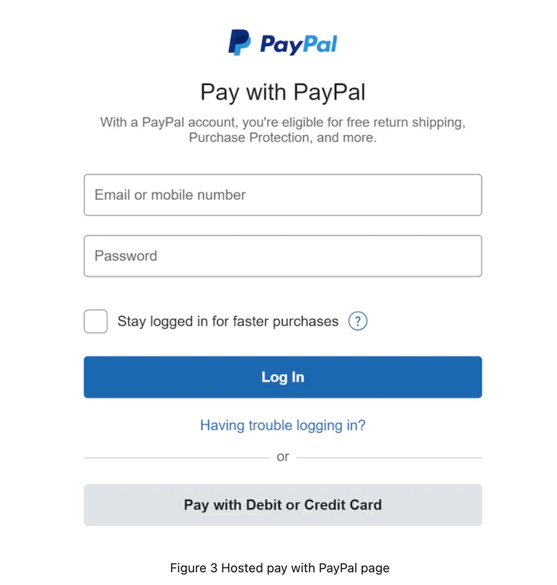

### 打款流程（Pay-out Flow）

付款流（Pay-out flow）的各个组件与付款流入（Pay-in flow）非常相似。两者的主要区别在于：在付款流入中，我们使用 PSP（支付服务提供商） 将资金从买家的信用卡转入电商网站的银行账户；而在付款流出中，我们使用 第三方付款服务提供商（pay-out provider） 将资金从电商网站的银行账户转入卖家的银行账户。

通常，支付系统会使用第三方的应付账款服务提供商（如 Tipalti [9]）来处理付款流出。因为在付款流出过程中，同样涉及大量的 账务记录和合规监管要求。

## 步骤 3：深入设计（Design Deep Dive）

在本节中，我们将重点探讨如何让支付系统更快、更可靠、更安全。  在分布式系统中，错误与故障不仅可能发生，而且非常常见。  例如，如果用户多次点击“支付”按钮，会不会被重复扣款？  如果由于网络问题导致支付中断，又该如何处理？  接下来，我们将深入分析以下关键主题：

- 与支付服务提供商（PSP）的集成  
- 对账（Reconciliation）  
- 支付处理延迟的应对  
- 内部服务之间的通信方式  
- 支付失败的处理机制  
- 精确一次投递（Exactly-once Delivery）  
- 一致性（Consistency）  
- 安全性（Security）

### PSP 集成（PSP Integration）

如果支付系统能够直接连接银行或卡组织（如 Visa、MasterCard），则可以不依赖 PSP 完成支付。  但这种方式成本高、要求严格，通常只有大型公司才会采用。  对于大多数企业而言，系统会通过以下两种方式之一与 PSP 集成：

1. 如果一家公司能够安全地存储敏感支付信息，并选择这样做，那么可以通过 API 将 PSP（支付服务提供商）集成到系统中。  公司需要负责开发支付网页、收集并存储敏感的支付信息；  而 PSP 则负责与银行或信用卡组织（如 Visa、MasterCard）建立连接。
2. 如果一家公司由于复杂的法规要求或安全性考虑而选择不存储敏感支付信息，  那么 PSP 会提供一个托管支付页面（hosted payment page），用于收集信用卡支付信息并安全地将其存储在 PSP 系统中。  这是大多数公司采用的方式。

我们将使用图 4 来详细说明托管支付页面的工作原理。

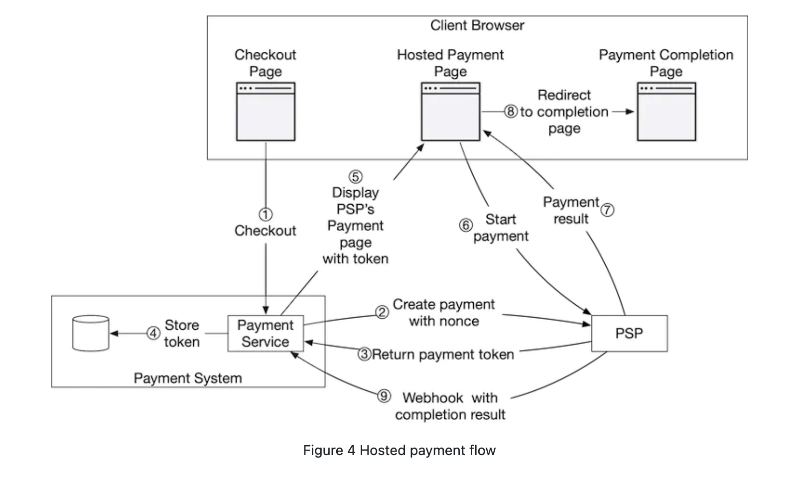

为了简化说明，我们在图 4 中省略了支付执行器（payment executor）、账本（ledger）和钱包（wallet）。 
支付服务（payment service）负责协调整个支付流程。

1. 用户在客户端浏览器中点击“结账（checkout）”按钮，客户端将支付订单信息发送给支付服务。  

2. 支付服务在收到支付订单信息后，会向 PSP（支付服务提供商）发送一个支付注册请求（payment registration request）。  该请求包含支付相关的信息，例如：金额、币种、支付请求的到期时间以及重定向 URL（redirect URL）。  由于每个支付订单只能注册一次，因此该请求中包含一个 UUID 字段，用于确保“仅一次注册（exactly-once registration）”。  这个 UUID 也被称为 nonce [10]，通常它就是支付订单的唯一 ID。
  
3. PSP 返回一个 token（令牌） 给支付服务。  这个 token 是 PSP 端的一个 UUID，用于唯一标识此次支付注册。 我们之后可以使用这个 token 来查询支付注册及其执行状态。
  
4. 支付服务在调用 PSP 托管支付页面（hosted payment page）之前，会先将 token 存入数据库。

5. 一旦 token 被保存，客户端就会显示一个 PSP 托管的支付页面。  移动端应用通常通过 PSP 的 SDK 来实现此功能。  这里以 Stripe 的网页集成（web integration） 为例（见图 5）。Stripe 提供一个 JavaScript 库，用于显示支付界面（payment UI）、收集敏感支付信息，并直接调用 PSP 完成支付。所有敏感支付信息都由 Stripe 收集，并不会传入我们的支付系统。托管支付页面通常需要以下两部分信息：  
   1. 步骤 4 中获取的 token。PSP 的 JavaScript 代码使用该 token 从 PSP 的后端获取支付请求的详细信息，其中一个重要信息是需要收取的金额。  
   
   2. 重定向 URL（redirect URL）。这是支付完成后跳转的网页 URL。 当 PSP 的 JavaScript 代码完成支付后，会将浏览器重定向到该 URL。通常，这个重定向 URL 是电商网站上的结账状态页面，用于显示支付结果。请注意，redirect URL 与第 9 步中的 webhook URL 不同 [11]。

6. 用户在 PSP（支付服务提供商）托管的网页上填写支付信息，例如信用卡号、持卡人姓名、有效期等，然后点击“支付”按钮。PSP 随即开始处理支付流程。  

7. PSP 返回支付状态。  

8. 网页随后被重定向到重定向 URL（redirect URL）。  在第 7 步中接收到的支付状态通常会附加到该 URL 后面。  例如，完整的重定向 URL 可能是：  
   https://your-company.com/?tokenID=JIOUIQ123NSF&payResult=X324FSa  
   
9. PSP 还会异步地通过 webhook（回调） 将支付状态发送给支付服务。  这个 webhook 是在系统初始配置 PSP 时注册的 URL，用于让 PSP 向支付系统报告支付结果。  当支付系统通过 webhook 收到支付事件时，它会提取支付状态信息，并更新数据库中 Payment Order（支付订单）表 的 `payment_order_status` 字段。  

到目前为止，我们介绍了托管支付页面（hosted payment page）的“理想流程”。 但在现实中，网络连接可能不稳定，上述九个步骤中的任何一个都可能失败。 有没有系统化的方法来处理这些失败情况？ 答案是：对账（Reconciliation）。

### 对账（Reconciliation）

当系统组件以异步方式通信时，无法保证消息一定会被送达，也无法保证一定会收到响应。  这种情况在支付业务中非常常见，因为支付系统通常使用异步通信来提高系统性能。外部系统（如 PSP 或银行）也倾向于使用异步通信。那么，在这种情况下我们该如何确保系统的正确性呢？

答案是：对账（Reconciliation）。对账是一种定期比较相关服务之间状态的做法，用来验证它们的数据是否一致。它通常是支付系统中的最后一道防线。

每天晚上，PSP 或银行都会向其客户发送一份结算文件（Settlement File）。  该文件包含当天银行账户的余额以及当天发生的所有交易记录。  对账系统会解析结算文件，并将其与账本系统（Ledger System）中的数据进行比对。  下方的图（图 6）展示了对账过程在整个支付系统中的位置。

对账还用于验证支付系统内部的一致性。  例如，账本（ledger）和钱包（wallet）中的状态可能会出现偏差， 我们可以使用对账系统来检测这些差异。

为了修复在对账过程中发现的不匹配（mismatch），我们通常依赖财务团队进行人工调整（manual adjustment）。这些不匹配和调整通常分为三类：

1. 可分类且可自动调整的差异（Classifiable & Automatable）. 在这种情况下，我们知道差异的原因，也知道如何修复它， 并且编写程序自动执行调整是划算的。  工程师可以自动化差异分类和调整两个步骤。  

2. 可分类但无法自动调整的差异（Classifiable but Non-Automatable）,在这种情况下，我们知道差异的原因，也知道修复方法，但编写自动调整程序的成本太高。这种差异会被放入任务队列（job queue）中，由财务团队手动修复。  

3. 无法分类的差异（Unclassifiable）, 在这种情况下，我们不知道差异是如何产生的。这种差异会被放入特殊任务队列（special job queue）中，由财务团队进行人工调查和处理.

### 支付处理延迟（Handling Payment Processing Delays）

正如前面讨论的那样，一个端到端的支付请求会经过许多组件，并涉及内部和外部的多个系统。 在大多数情况下，支付请求会在几秒钟内完成，但有时支付请求可能会卡住，甚至需要几个小时或几天才能完成或被拒绝。  
以下是一些导致支付请求耗时较长的常见情况：

- PSP（支付服务提供商）认为该支付请求风险较高，需要人工审核。  
- 信用卡需要额外的安全验证，比如 3D Secure 认证 [13]，要求持卡人提供额外信息以验证购买行为。

支付服务必须能够处理这些需要较长时间完成的支付请求。  如果购买页面由外部 PSP 托管（这在如今非常常见），PSP 会通过以下方式处理这些长时间运行的支付请求：

* PSP 会向客户端返回一个待处理（pending）状态。客户端会将此状态显示给用户，同时提供一个页面，让客户可以随时查看当前支付状态。  
* PSP 会代表我们跟踪该笔待处理的支付请求， 并通过支付服务在注册时提供的 webhook 回调地址 通知任何支付状态的更新。  

当支付请求最终完成时， PSP 会调用前面提到的 webhook, 支付服务收到通知后会更新内部系统，并继续处理后续业务，例如向客户发货。  

或者，某些 PSP 不使用 webhook 通知支付结果，而是要求支付服务主动轮询（polling） PSP，以获取所有待处理支付请求的最新状态更新。

### 内部服务之间的通信（Communication among internal services）

内部服务之间通常有两种通信模式：同步通信（synchronous） 和 异步通信（asynchronous）。下面分别介绍这两种方式。

#### 同步通信（Synchronous communication）

同步通信（例如 HTTP 调用）在小规模系统中运行良好，但随着系统规模的扩大，其缺点会逐渐显现。这种方式在多个服务之间形成了一个长的请求-响应链条，导致系统的整体性能和可靠性都受到限制。

同步通信的主要缺点包括：

* 性能低（Low performance）如果调用链中的某个服务性能不佳，整个系统的响应速度都会受到影响。
* 故障隔离差（Poor failure isolation）如果 PSP（支付服务提供商）或其他依赖服务出现故障，客户端将无法获得响应。
* 耦合度高（Tight coupling）请求的发送方必须知道接收方的具体信息，这使得系统扩展或替换服务变得困难。
* 难以扩展（Hard to scale）如果不使用消息队列作为缓冲层，系统就难以应对突发的大流量。

#### 异步通信（Asynchronous communication）

异步通信可以分为两种类型：

* 单接收者：每个请求（消息）只会被一个接收者或服务处理。这种模式通常通过共享消息队列（shared message queue）来实现。消息队列可以有多个订阅者，但一旦某条消息被处理完成，它就会从队列中移除。我们来看一个具体的例子：在图 9 中，服务 A 和服务 B 都订阅了同一个共享消息队列。当消息 m1 被服务 A 消费、消息 m2 被服务 B 消费后，这两条消息都会从队列中删除，如图 10 所示。

  

* 多接收者：每个请求（消息）会被多个接收者或服务处理。在这种场景下，Kafka 的表现非常出色。

  当消费者接收消息时，消息**不会**从 Kafka 中被移除，因此同一条消息可以被不同的服务同时处理。这种模型非常适合支付系统，因为同一个请求可能会触发多个“副作用”（side effects），例如：发送推送通知, 更新财务报表, 触发分析统计等。如图 11 所示，这是一个典型的例子：支付事件会被发布到 Kafka，然后被不同的服务（如支付系统、分析系统、账单系统等）共同消费。

  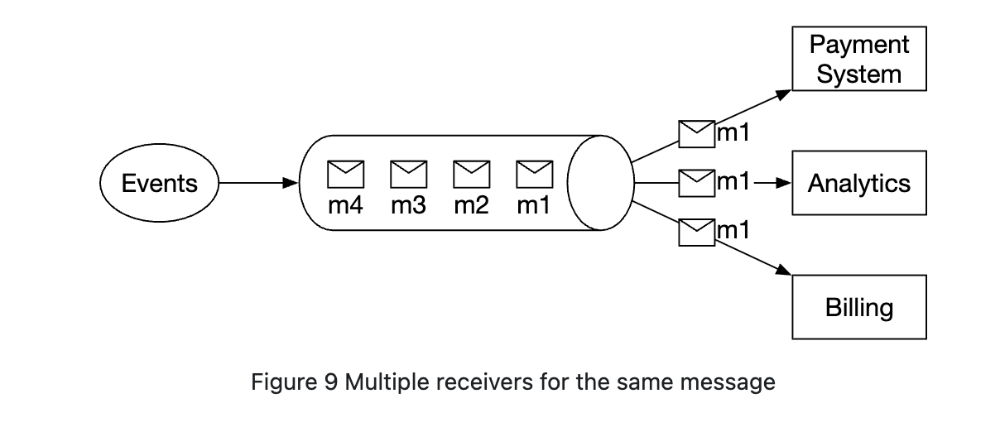

一般来说，同步通信（synchronous communication） 的设计更简单，但它无法让服务实现真正的自治（autonomous）。随着系统中依赖关系图（dependency graph）的不断扩大，整体性能会逐渐下降。异步通信（asynchronous communication） 则在一定程度上牺牲了设计的简洁性和数据一致性，以换取更高的可扩展性（scalability）和故障恢复能力（failure resilience）。对于一个业务逻辑复杂、依赖大量第三方服务的大型支付系统来说，异步通信无疑是更好的选择。

### 支付失败的处理（Handling Failed Payments）

每个支付系统都必须处理失败的交易。可靠性和容错性是关键要求。下面我们将回顾一些应对这些挑战的技术。

####  跟踪支付状态（Tracking payment state）

在支付周期的任何阶段，拥有一个明确的支付状态都是至关重要的。每当发生故障时，我们就能确定支付交易的当前状态，并判断是否需要重试或退款。支付状态可以存储在一个仅追加（append-only）的数据库表中，以保证不可篡改的记录。

#### 重试队列与死信队列（Retry queue and Dead letter queue）

为了优雅地处理失败情况，我们使用重试队列（retry queue）和死信队列（dead letter queue），如图 12 所示。

- 重试队列（Retry queue）：可重试的错误（例如临时性错误）会被路由到重试队列中。
- 死信队列（Dead letter queue）： 如果一条消息多次重试仍然失败，它最终会被放入死信队列中。死信队列对于调试（debugging）和隔离问题消息（isolating problematic messages）非常有用,可以帮助我们检查并确定这些消息为什么没有被成功处理。

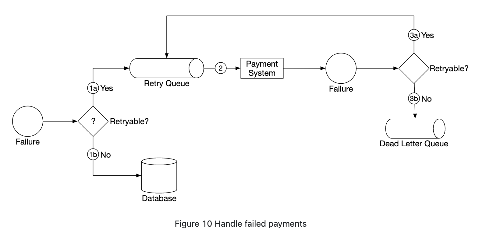

1. 检查故障是否可重试。

   1a. 可重试的故障会被路由到重试队列中。

   1b. 对于不可重试的故障（例如无效输入），错误信息会被存储到数据库中。

2. 支付系统会从重试队列中读取事件，并对失败的支付交易进行重试。

3. 如果支付交易再次失败：

   3a. 如果重试次数未超过阈值，该事件会再次被路由到重试队列。

   3b. 如果重试次数超过阈值，该事件会被放入死信队列。这些失败的事件可能需要进一步调查。

如果你对使用这些队列的真实案例感兴趣，可以了解一下 Uber 的支付系统，它使用 Kafka 来满足可靠性和容错性的要求 [16]。

### 精确一次投递（Exactly-once Delivery）

支付系统可能遇到的最严重问题之一就是对客户重复扣款。在系统设计中，必须保证支付系统能够**“恰好执行一次”（exactly-once）**支付指令。[16]

乍一看，实现“恰好一次”似乎非常困难，但如果我们将问题拆解为两个部分，就容易得多。 从数学上讲，一个操作若要“恰好执行一次”，必须同时满足以下两个条件：

1. 至少执行一次（at-least-once）；
2. 至多执行一次（at-most-once）。

我们将解释如何通过“重试（retry）”实现“至少执行一次”，以及如何通过“幂等性检查（idempotency check）”实现“至多执行一次”。

#### 重试（Retry）

有时由于网络错误或超时，我们需要重试支付交易。重试机制可以保证“至少执行一次”。例如，如图 13 所示，客户端尝试进行一笔 10 美元的支付，但由于网络连接不良，请求不断失败。在此示例中，网络最终恢复正常，请求在第四次尝试时成功

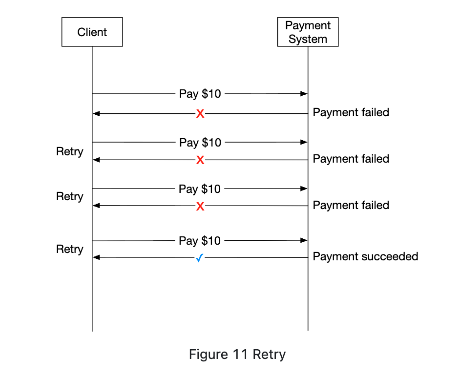

决定重试之间的时间间隔非常重要。以下是一些常见的重试策略。

* 立即重试：客户端立即重新发送请求。
* 固定间隔：在支付失败与新重试尝试之间等待固定的时间。
* 递增间隔：客户端在第一次重试前等待较短的时间，然后在随后的重试中逐步增加等待时间。
* 指数退避（Exponential backoff）[17]：在每次重试失败后，将重试之间的等待时间加倍。例如，第一次请求失败后，我们在 1 秒后重试；如果第二次失败，我们在 2 秒后重试；第三次失败，则在 4 秒后再试。
* 取消：客户端可以取消请求。这在故障是永久性的，或重复请求成功的可能性很低时，是一种常见做法。

确定合适的重试策略并不容易。没有一种“放之四海而皆准”的解决方案。一般来说，如果网络问题在短时间内不太可能解决，可以使用指数退避策略。过于频繁的重试会浪费计算资源，并可能导致服务过载。一个良好的实践是，在响应中提供一个带有 Retry-After 头部的错误代码。

重试的一个潜在问题是重复支付。我们来看两个场景。

**场景 1：**支付系统通过托管支付页面与 PSP 集成，而客户端连续点击两次“支付”按钮。

**场景 2：**支付被 PSP 成功处理，但由于网络错误，响应未能到达我们的支付系统。用户再次点击“支付”按钮，或者客户端自动重试支付。

为了避免重复支付，支付操作必须最多执行一次。这种“最多一次执行”的保证也被称为幂等性（idempotency）。

#### 幂等性

幂等性是确保“最多一次执行”保证的关键。根据维基百科的定义，幂等性是数学和计算机科学中某些操作的一种属性，即该操作可以被多次执行，而不会改变第一次执行之后的结果。从 API 的角度看，幂等性意味着客户端可以多次发起相同的调用，并且得到相同的结果。

在客户端（网页和移动应用）与服务器之间的通信中，幂等键（idempotency key）通常是一个由客户端生成的唯一值，并在一段时间后过期。UUID 通常被用作幂等键，并被许多科技公司（如 Stripe 和 PayPal）推荐使用。要执行一个幂等的支付请求，可以在 HTTP 请求头中添加幂等键，例如：<idempotency-key: key_value>。

现在我们了解了幂等性的基本概念，让我们看看它如何帮助解决上面提到的重复支付问题。

**场景 1：**如果客户快速点击两次“支付”按钮，会怎样？

如图 14 所示，当用户点击“支付”按钮时，一个幂等键会作为 HTTP 请求的一部分被发送到支付系统中。在电子商务网站中，幂等键通常是结账前购物车的 ID。

对于第二个请求，系统会将其视为一次重试，因为支付系统已经见过相同的幂等键。当我们在请求头中包含先前指定的幂等键时，支付系统会返回上一个请求的最新状态。

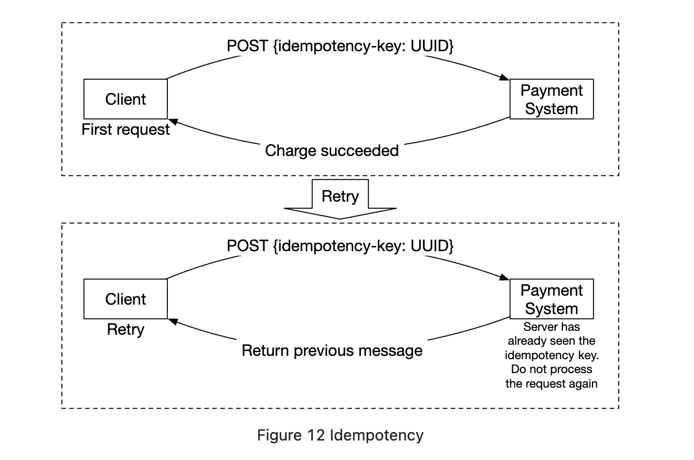

如果检测到多个并发请求使用相同的幂等键（idempotency key），系统只会处理其中一个请求，其他请求将收到 “429 Too Many Requests（请求过多）” 的状态码。

为了支持幂等性，我们可以利用数据库的唯一键约束。例如，可以将数据库表的主键作为幂等键来使用。其工作原理如下：

1. 当支付系统接收到一笔支付请求时，它会尝试向数据库表中插入一条记录。
2. 如果插入成功，说明这是一个新的支付请求，系统之前未处理过。
3. 如果插入失败，是因为相同的主键已经存在，说明系统之前已经处理过这笔支付请求。此时第二个请求将不会被再次处理。

**场景 2：支付已被 PSP 成功处理，但由于网络错误，响应未能返回到我们的支付系统，然后用户再次点击“支付”按钮。**

如图 4（步骤 2 和步骤 3）所示，支付服务向 PSP 发送一个随机数（nonce），PSP 返回一个对应的令牌（token）。这个随机数唯一标识支付订单，而令牌唯一对应这个随机数，因此令牌也唯一映射到该支付订单。

当用户再次点击“支付”按钮时，支付订单是相同的，因此发送给 PSP 的令牌也是相同的。由于 PSP 端使用该令牌作为幂等键，它能够识别出这是一次重复支付，并返回上一次执行的状态结果。

### 一致性（Consistency）

在一次支付执行过程中，会调用多个有状态服务（stateful services）：

1. 支付服务（Payment Service）：保存与支付相关的数据，例如 nonce（随机数）、token（令牌）、支付订单、执行状态等。
2. 账本服务（Ledger）：保存所有会计数据。
3. 钱包服务（Wallet）：保存商家的账户余额。
4. 支付服务提供商（PSP）：保存支付执行的状态。
5. 为了提高可靠性，数据可能会在不同的数据库副本（replicas）之间进行复制。

在分布式环境中，任意两个服务之间的通信都有可能失败，从而导致数据不一致（data inconsistency）。下面我们来看一些用于解决支付系统中数据不一致问题的常用技术。

为了维持内部服务之间的数据一致性，确保仅执行一次（exactly-once）的处理非常重要。这意味着每一笔支付操作只能被处理一次，不会被重复执行，也不会被遗漏。

为了在内部服务与外部服务（PSP）之间保持数据一致性，我们通常依赖幂等性（idempotency）和对（reconciliation）。 如果外部服务支持幂等性，那么在支付重试操作时，我们应使用相同的幂等键（idempotency key）。即使外部服务支持幂等 API，仍然需要进行对账，因为我们不应假设外部系统的结果总是正确的。

如果数据被复制，复制延迟可能会导致主数据库与副本之间的数据不一致。通常有两种方法可以解决这个问题：

1. 只使用主数据库来处理读写请求。这种方法设置简单，但显而易见的缺点是可扩展性较差。副本仅用于数据可靠性保障，但并不承担流量，从而造成资源浪费。
2. 确保所有副本始终保持同步。我们可以使用诸如 Paxos[21] 或 Raft[22]这样的共识算法，或者使用基于共识的分布式数据库，例如 YugabyteDB[23] 或 CockroachDB[24]。

### 支付安全（Payment Security）

支付安全非常重要。 在本系统设计的最后部分，我们将简要介绍一些用于防范网络攻击和信用卡盗用的技术手段。

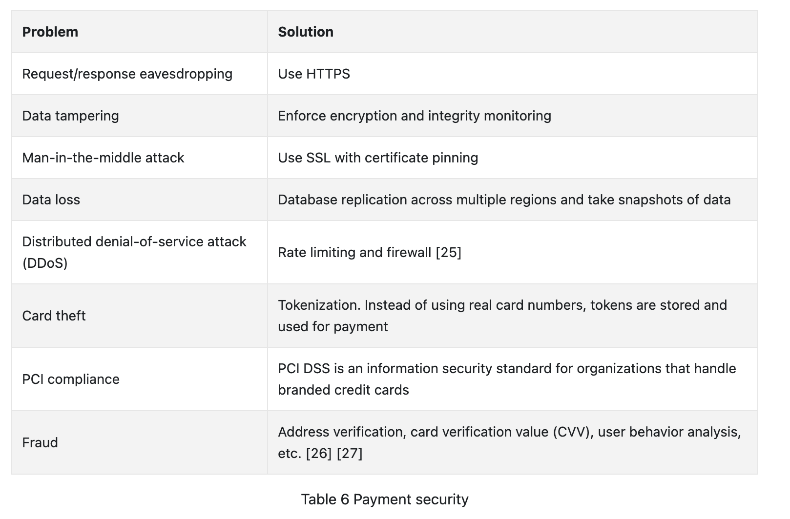

## 第4步 - 总结

在本章中，我们研究了收款流程（Pay-in flow）和打款流程（Pay-out flow）。我们深入探讨了重试机制（retry）、幂等性（idempotency）以及一致性（consistency）。在本章的结尾，我们还讨论了支付错误处理和安全性相关的内容。

支付系统极其复杂。尽管我们已经涵盖了许多主题，但仍有一些值得进一步讨论的内容。下面列出的是一些具有代表性但并不完整的相关主题。

* **监控（Monitoring）**: 监控关键指标是现代应用程序中非常重要的一部分。通过完善的监控，我们可以回答如下问题：“某种支付方式的平均成功率是多少？”、“我们服务器的 CPU 使用率是多少？”等。我们可以将这些指标创建并展示在监控仪表盘（dashboard）上
* 告警（Alerting）: 当系统出现异常时，及时通知值班开发人员（on-call developers）非常重要，以便他们能够迅速响应。
* **调试工具（Debugging Tools）**: “为什么支付失败？”是一个常见的问题。为了让工程师和客服更容易排查问题，开发能够查看交易状态、处理服务器历史记录、PSP 记录等的工具非常重要。
* **货币兑换（Currency Exchange）**:在为国际用户群设计支付系统时，货币兑换是一个重要的考虑因素。
* **地理因素（Geography）**:不同地区可能有完全不同的支付方式。
* **现金支付（Cash Payment）**:现金支付在印度、巴西和其他一些国家非常普遍。Uber [28] 和 Airbnb [29] 曾撰写过详细的技术博客，介绍他们是如何处理基于现金的支付方式的。
* **Google Pay / Apple Pay 集成。**:如有兴趣，可参考文献 [30] 了解更多内容。

恭喜你读完本章！现在请为自己鼓掌或拍一下肩膀表示赞赏。干得漂亮！

### 章节总结

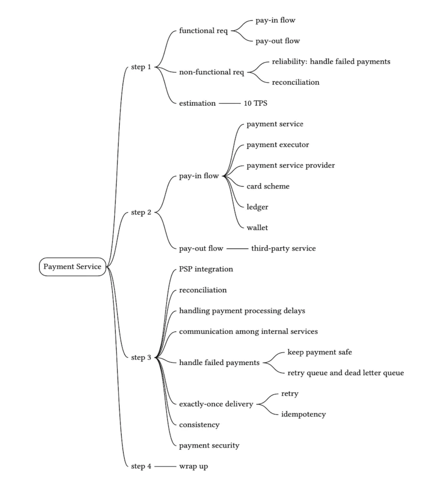

## 参考资料

[1] Payment system: https://en.wikipedia.org/wiki/Payment_system

[2] AML/CFT: https://en.wikipedia.org/wiki/Money_laundering

[3] Card scheme: https://en.wikipedia.org/wiki/Card_scheme

[4] ISO 4217: https://en.wikipedia.org/wiki/ISO_4217

[5] Stripe API Reference: https://stripe.com/docs/api

[6] Double-entry bookkeeping: https://en.wikipedia.org/wiki/Double-entry_bookkeeping

[7] Books, an immutable double-entry accounting database service:
https://developer.squareup.com/blog/books-an-immutable-double-entry-accounting-database-service/

[8] Payment Card Industry Data Security Standard:
https://en.wikipedia.org/wiki/Payment_Card_Industry_Data_Security_Standard

[9] Tipalti: https://tipalti.com/

[10] Nonce: https://en.wikipedia.org/wiki/Cryptographic_nonce

[11] Webhooks: https://stripe.com/docs/webhooks

[12] Customize your success page: https://stripe.com/docs/payments/checkout/custom-success-page

[13] 3D Secure: https://en.wikipedia.org/wiki/3-D_Secure

[14] Kafka Connect Deep Dive – Error Handling and Dead Letter Queues:
https://www.confluent.io/blog/kafka-connect-deep-dive-error-handling-dead-letter-queues/

[15] Reliable Processing in a Streaming Payment System:
https://www.youtube.com/watch?v=5TD8m7w1xE0&list=PLLEUtp5eGr7Dz3fWGUpiSiG3d_WgJe-KJ

[16] Chain Services with Exactly-Once Guarantees:
https://www.confluent.io/blog/chain-services-exactly-guarantees/

[17] Exponential backoff: https://en.wikipedia.org/wiki/Exponential_backoff

[18] Idempotence: https://en.wikipedia.org/wiki/Idempotence

[19] Stripe idempotent requests: https://stripe.com/docs/api/idempotent_requests

[20] Idempotency: https://developer.paypal.com/docs/platforms/develop/idempotency/

[21] Paxos: https://en.wikipedia.org/wiki/Paxos_(computer_science)

[22] Raft: https://raft.github.io/

[23] YogabyteDB: https://www.yugabyte.com/

[24] Cockroachdb:https://www.cockroachlabs.com/

[25] What is DDoS attack: https://www.cloudflare.com/learning/ddos/what-is-a-ddos-attack/

[26] How Payment Gateways Can Detect and Prevent Online Fraud: https://www.chargebee.com/blog/optimize-online-billing-stop-online-fraud/

[27] Advanced Technologies for Detecting and Preventing Fraud at Uber: https://eng.uber.com/advanced-technologies-detecting-preventing-fraud-uber/

[28] Re-Architecting Cash and Digital Wallet Payments for India with Uber Engineering: https://eng.uber.com/india-payments/

[29] Scaling Airbnb’s Payment Platform: https://medium.com/airbnb-engineering/scaling-airbnbs-payment-platform-43ebfc99b324

[30] Payments Integration at Uber: A Case Study: https://www.youtube.com/watch?v=yooCE5B0SRA